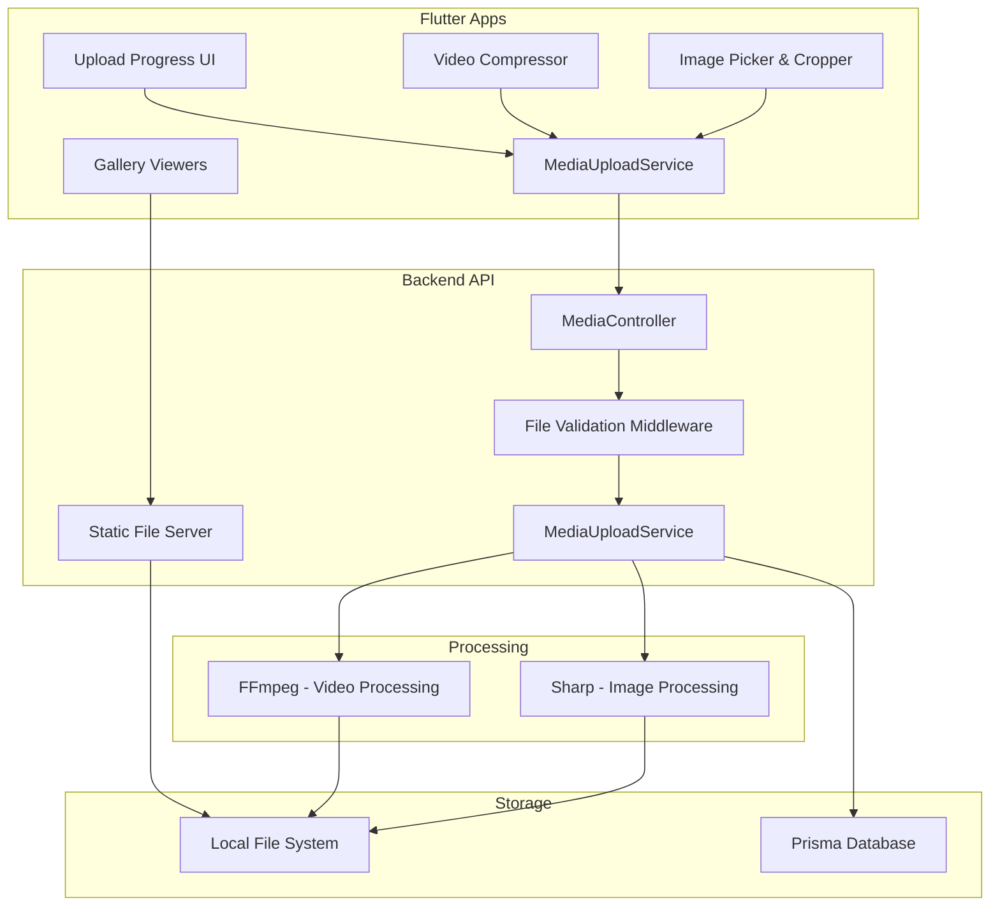
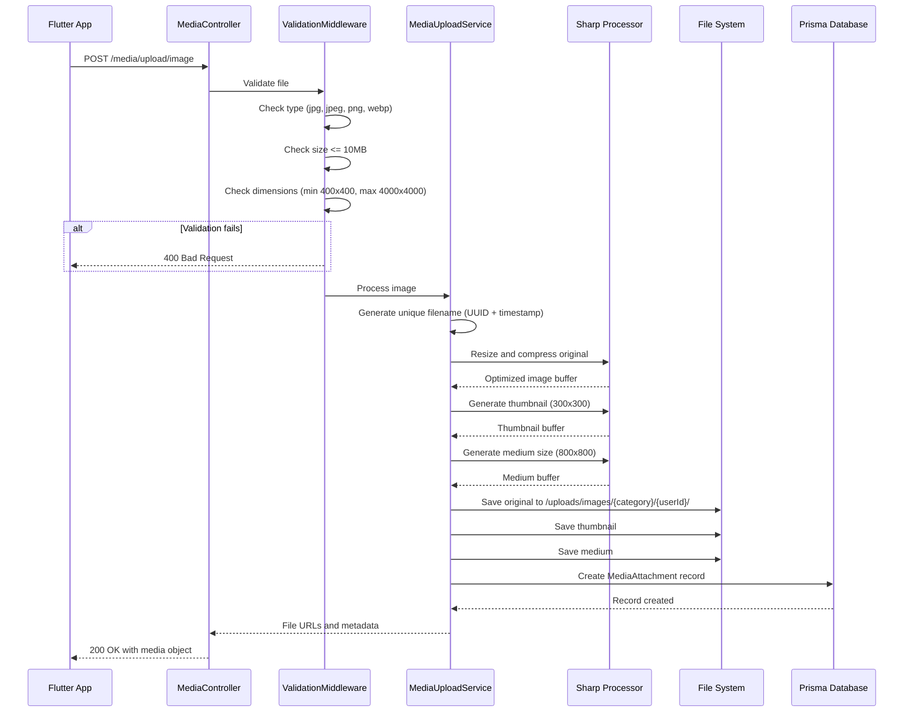
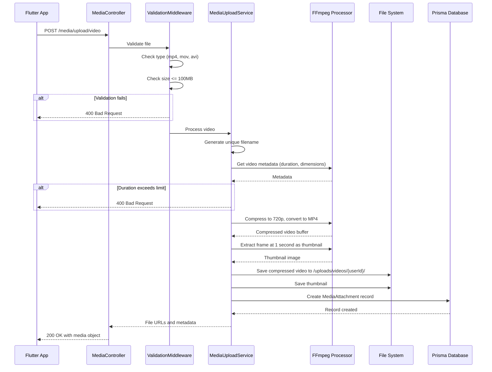
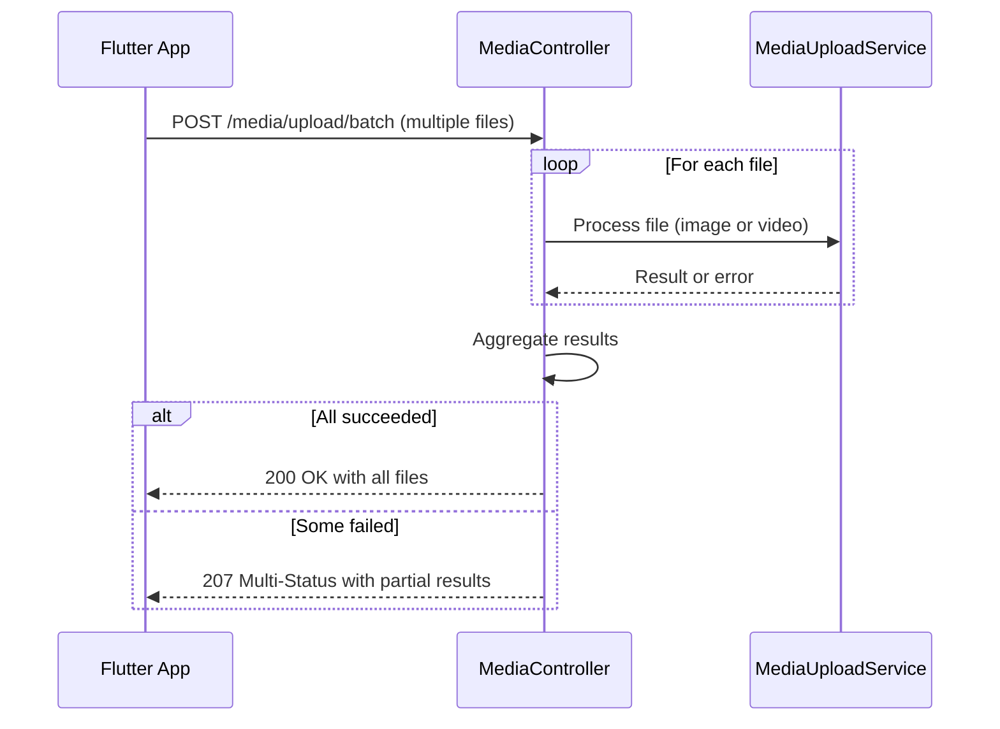

# Image and Video Upload System Design

## Purpose and Value

This design establishes a comprehensive media upload and management system that enables users to upload, process, store, and display images and videos across the Mesteri platform. The system supports portfolio showcases, profile photos, job attachments, and before/after project documentation, enhancing user engagement and trust through visual content.

## Strategic Context

The platform currently has a Google Cloud Storage integration for attachment management. This design extends the storage capabilities to include local file processing and optimized media handling for images and videos, with an architecture that allows migration to cloud storage when needed. The system prioritizes user experience through client-side compression, progress tracking, and optimized delivery.

## System Boundaries

### In Scope
- Image upload, processing, compression, and thumbnail generation
- Video upload, compression, and preview frame extraction
- Batch media upload with progress tracking
- Media gallery and viewer components
- Permission management for camera and storage access
- File validation and security checks
- Static file serving with authentication
- Media metadata storage and retrieval

### Out of Scope
- Live video streaming or recording
- Advanced video editing capabilities
- AI-powered image recognition or tagging
- CDN configuration and management
- Malware scanning implementation details
- Migration logic from existing GCS storage
- Social media sharing integrations

## Architecture Overview

### System Components



## Data Model

### Database Schema Extensions

#### MediaAttachment Table

| Field | Type | Constraints | Description |
|-------|------|-------------|-------------|
| id | String | PK, CUID | Unique identifier |
| userId | String | FK, Required | Owner of the media |
| fileUrl | String | Required | Relative path to original file |
| thumbnailUrl | String | Optional | Path to thumbnail (images/video preview) |
| mediumUrl | String | Optional | Medium-sized version (800x800) |
| fileType | Enum | Required | IMAGE or VIDEO |
| category | Enum | Required | PORTFOLIO, PROFILE, JOB, BEFORE_AFTER, INSPIRATION |
| entityId | String | Optional | Related entity ID (jobId, portfolioId, etc.) |
| fileName | String | Required | Original filename |
| mimeType | String | Required | File MIME type |
| fileSize | Integer | Required | Size in bytes |
| width | Integer | Optional | Image/video width in pixels |
| height | Integer | Optional | Image/video height in pixels |
| duration | Float | Optional | Video duration in seconds |
| status | Enum | Required | PROCESSING, ACTIVE, FAILED, DELETED |
| metadata | JSON | Optional | Additional metadata (camera info, location, etc.) |
| createdAt | DateTime | Auto | Upload timestamp |
| updatedAt | DateTime | Auto | Last update timestamp |

#### MediaCategory Enumeration
- PORTFOLIO: Craftsman work samples
- PROFILE: User profile photos
- JOB: Job description attachments
- BEFORE_AFTER: Project comparison photos
- INSPIRATION: Inspiration feed content

#### MediaFileType Enumeration
- IMAGE: Static images
- VIDEO: Video files

#### MediaStatus Enumeration
- PROCESSING: Being processed
- ACTIVE: Ready for use
- FAILED: Processing failed
- DELETED: Soft deleted

### Configuration Parameters

| Parameter | Environment Variable | Default Value | Description |
|-----------|---------------------|---------------|-------------|
| Upload Path | UPLOAD_PATH | /storage/uploads | Root directory for uploads |
| Max Image Size | MAX_IMAGE_SIZE | 10485760 (10MB) | Maximum image file size in bytes |
| Max Video Size | MAX_VIDEO_SIZE | 104857600 (100MB) | Maximum video file size in bytes |
| Max Batch Size | MAX_BATCH_FILES | 10 | Maximum files per batch upload |
| Image Quality | IMAGE_QUALITY | 85 | JPEG compression quality percentage |
| Thumbnail Size | THUMBNAIL_SIZE | 300 | Thumbnail dimension in pixels |
| Medium Size | MEDIUM_SIZE | 800 | Medium image dimension in pixels |
| Max Video Duration | MAX_VIDEO_DURATION | 300 (5 min) | Maximum video duration in seconds |
| Video Output Format | VIDEO_OUTPUT_FORMAT | mp4 | Video output format |
| Video Resolution | VIDEO_MAX_RESOLUTION | 720p | Maximum video resolution |

## API Contracts

### Backend Endpoints

#### Upload Single Image
```
POST /media/upload/image
Headers: Authorization: Bearer {token}
Content-Type: multipart/form-data

Request Body:
- file: Binary (required) - Image file
- category: String (required) - MediaCategory enum value
- entityId: String (optional) - Related entity identifier

Response: 200 OK
{
  "id": "clx...",
  "url": "/uploads/images/portfolio/user123/uuid-filename.jpg",
  "thumbnailUrl": "/uploads/images/portfolio/user123/uuid-filename-thumb.jpg",
  "mediumUrl": "/uploads/images/portfolio/user123/uuid-filename-medium.jpg",
  "width": 1920,
  "height": 1080,
  "fileSize": 245632,
  "mimeType": "image/jpeg"
}

Error Responses:
- 400: Invalid file type or size exceeded
- 401: Unauthorized
- 413: Payload too large
- 500: Processing failed
```

#### Upload Single Video
```
POST /media/upload/video
Headers: Authorization: Bearer {token}
Content-Type: multipart/form-data

Request Body:
- file: Binary (required) - Video file
- category: String (required) - MediaCategory enum value
- entityId: String (optional) - Related entity identifier

Response: 200 OK
{
  "id": "clx...",
  "url": "/uploads/videos/user123/uuid-filename.mp4",
  "thumbnailUrl": "/uploads/videos/user123/uuid-filename-thumb.jpg",
  "duration": 45.3,
  "width": 1280,
  "height": 720,
  "fileSize": 8456320,
  "mimeType": "video/mp4"
}

Error Responses:
- 400: Invalid file type, size, or duration exceeded
- 401: Unauthorized
- 413: Payload too large
- 500: Processing failed
```

#### Upload Multiple Files
```
POST /media/upload/batch
Headers: Authorization: Bearer {token}
Content-Type: multipart/form-data

Request Body:
- files: Binary[] (required) - Array of files (max 10)
- category: String (required) - MediaCategory enum value
- entityId: String (optional) - Related entity identifier

Response: 200 OK
{
  "files": [
    { /* same structure as single upload */ },
    { /* ... */ }
  ],
  "totalUploaded": 5,
  "failed": []
}

Partial Success Response: 207 Multi-Status
{
  "files": [ /* successful uploads */ ],
  "failed": [
    {
      "fileName": "invalid.txt",
      "error": "Unsupported file type"
    }
  ],
  "totalUploaded": 4
}
```

#### Delete Media File
```
DELETE /media/:id
Headers: Authorization: Bearer {token}

Response: 200 OK
{
  "message": "Media deleted successfully",
  "id": "clx..."
}

Error Responses:
- 401: Unauthorized
- 403: Not the owner
- 404: Media not found
```

#### Get User Media by Category
```
GET /media/:userId/:category
Headers: Authorization: Bearer {token}
Query Parameters:
- page: Integer (default: 1)
- limit: Integer (default: 20)
- sortBy: String (default: "createdAt")
- order: String (default: "desc")

Response: 200 OK
{
  "media": [ /* array of media objects */ ],
  "total": 45,
  "page": 1,
  "totalPages": 3
}
```

#### Serve Static Files
```
GET /uploads/**
Headers: Authorization: Bearer {token} (optional for public files)

Response: 200 OK
Content-Type: image/jpeg | video/mp4 | etc.
[Binary file content]

Headers:
- Cache-Control: public, max-age=31536000
- ETag: "hash-value"
```

## Processing Workflows

### Image Upload Flow



### Video Upload Flow



### Batch Upload Flow



## Flutter Application Design

### Service Architecture

#### MediaUploadService Responsibilities
- Coordinate file selection from camera or gallery
- Apply client-side compression before upload
- Manage upload progress and state
- Handle HTTP multipart requests to backend
- Retry failed uploads with exponential backoff
- Cache uploaded files locally until confirmed

#### Permission Management Strategy
- Request permissions lazily when needed
- Show rationale dialog if previously denied
- Gracefully handle permanent denial with settings redirect
- Support both Android and iOS permission models

### UI Component Specifications

#### ProfilePhotoUploadWidget

**Purpose**: Reusable component for uploading and displaying profile photos

**Visual Structure**:
- Circular avatar container (120x120 default size)
- Overlayed camera icon button in bottom-right corner
- Loading spinner during upload
- Error indicator for failed uploads

**User Interactions**:
- Tap avatar: Opens bottom sheet with options
  - "Take Photo" - Opens camera
  - "Choose from Gallery" - Opens photo picker
  - "Remove Photo" - Deletes current photo (if exists)
- After selection: Automatically crops to square/circle
- On crop complete: Immediate upload with progress indicator

**State Management**:
- Loading state during upload
- Success state with new photo URL
- Error state with retry option
- Empty state with placeholder icon

#### ImageGalleryScreen

**Purpose**: Full-screen image viewer with navigation and zoom

**Features**:
- Swipeable carousel for multiple images
- Pinch-to-zoom gesture support
- Double-tap to zoom in/out
- Share button in app bar
- Download button to save to device
- Close button to exit viewer
- Image counter (e.g., "3 / 10")

**Navigation**:
- Receives list of image URLs and initial index
- Swipe left/right to navigate
- Supports preloading adjacent images

#### VideoPlayerScreen

**Purpose**: Full-screen video playback with controls

**Controls**:
- Play/pause button overlay
- Seek bar with current time and duration
- Volume control
- Fullscreen toggle
- Loading indicator while buffering
- Error message for playback failures

**Behavior**:
- Auto-pause when app goes to background
- Resume when returning to foreground
- Release resources when screen disposed
- Handle network errors gracefully

#### BeforeAfterPhotosWidget

**Purpose**: Split-screen comparison for project photos

**Visual Design**:
- Split-screen layout with draggable slider
- "Before" label on left, "After" label on right
- Tap to toggle full before or full after view
- Checkbox "Add to Portfolio" for completed projects

**Interaction**:
- Drag vertical slider to reveal before/after
- Tap image to view full-screen in ImageGalleryScreen

#### UploadProgressIndicator

**Purpose**: Visual feedback during file uploads

**Display Elements**:
- Linear progress bar showing percentage
- File name being uploaded
- Current upload speed (KB/s)
- Cancel button to abort upload
- Multiple upload queue status

**States**:
- Queued: Gray with "Waiting..." text
- Uploading: Blue progress bar with percentage
- Completed: Green with checkmark
- Failed: Red with retry button

### Screen Integration Points

#### Portfolio Management Screen
**Media Usage**: Display grid of portfolio images and videos with play icon overlay on videos

**Upload Flow**:
1. User taps "Add to Portfolio" button
2. Bottom sheet offers "Add Image" or "Add Video"
3. After selection, file is compressed locally
4. Upload begins with progress indicator
5. On success, new media appears in portfolio grid
6. Maximum 5 images + 2 videos per portfolio item enforced

**Display Requirements**:
- Grid layout with 2 columns
- Video thumbnails show duration badge
- Tap opens full-screen viewer

#### Profile Screen
**Media Usage**: Profile photo display and update

**Upload Flow**:
1. ProfilePhotoUploadWidget embedded in header
2. User selects photo via widget
3. Cropper opens with circular crop option
4. Immediate upload on crop completion
5. Profile updates with new photo URL

#### Job Creation/Edit Screen
**Media Usage**: Attach reference photos to job description

**Upload Flow**:
1. "Attach Photos" button opens image picker (multi-select)
2. Display selected images in horizontal scrollable list
3. Each image has remove button
4. Maximum 5 images enforced
5. Upload when job is saved/updated
6. Images stored with category=JOB and entityId=jobId

**Display Requirements**:
- Horizontal scrollable list of thumbnails (80x80)
- Remove icon on each thumbnail
- Add button at end if under limit

#### Project Completion Flow
**Media Usage**: Upload before/after photos for completed projects

**Upload Flow**:
1. "Upload Before Photo" and "Upload After Photo" buttons
2. BeforeAfterPhotosWidget displays comparison
3. Checkbox "Add to Portfolio" auto-saves to craftsman portfolio
4. Photos stored with category=BEFORE_AFTER and entityId=projectId

## File Organization Strategy

### Backend Directory Structure
```
/storage/uploads/
├── images/
│   ├── portfolio/
│   │   └── {userId}/
│   │       ├── {uuid}-{timestamp}-original.jpg
│   │       ├── {uuid}-{timestamp}-thumb.jpg
│   │       └── {uuid}-{timestamp}-medium.jpg
│   ├── profiles/
│   │   └── {userId}/
│   │       └── {uuid}-{timestamp}.jpg
│   ├── jobs/
│   │   └── {userId}/
│   │       └── {uuid}-{timestamp}.jpg
│   └── before_after/
│       └── {projectId}/
│           ├── before-{uuid}.jpg
│           └── after-{uuid}.jpg
└── videos/
    ├── portfolio/
    │   └── {userId}/
    │       ├── {uuid}-{timestamp}.mp4
    │       └── {uuid}-{timestamp}-thumb.jpg
    └── inspiration/
        └── {userId}/
            └── {uuid}-{timestamp}.mp4
```

### Filename Convention
**Pattern**: `{uuid}-{timestamp}-{variant}.{extension}`
- UUID: Unique identifier to prevent conflicts
- Timestamp: ISO format without special chars (2024-01-15T14-30-00)
- Variant: original, thumb, medium (for images)
- Extension: Based on processed format

**Example**: `a7b9c3d1-2024-01-15T14-30-00-medium.jpg`

## Validation and Security

### File Type Validation

**Allowed Image Types**:
- MIME types: image/jpeg, image/png, image/webp
- Extensions: .jpg, .jpeg, .png, .webp
- Verification: Check both MIME type and file magic bytes

**Allowed Video Types**:
- MIME types: video/mp4, video/quicktime, video/x-msvideo
- Extensions: .mp4, .mov, .avi
- Verification: Check MIME type and file signature

### Size Constraints

| Media Type | Maximum Size | Rationale |
|------------|--------------|-----------|
| Images | 10 MB | Balance quality and upload time |
| Videos | 100 MB | Limit for mobile uploads |
| Batch Upload | 10 files | Prevent server overload |

### Dimension Constraints

**Images**:
- Minimum: 400x400 pixels (quality threshold)
- Maximum: 4000x4000 pixels (prevent excessive memory usage)

**Videos**:
- Minimum: 480p (quality threshold)
- Maximum: 1080p input (will be compressed to 720p)
- Duration: Maximum 5 minutes (300 seconds)

### Security Measures

**Authentication**:
- All upload endpoints require valid JWT token
- User can only delete their own media
- Static file serving validates ownership for private files

**Malware Prevention**:
- File type validation beyond extension checking
- Magic byte verification
- Future: ClamAV integration for production scanning
- Quarantine suspicious files with status=QUARANTINED

**Path Traversal Prevention**:
- Validate userId and entityId parameters
- Use path.join() for safe path construction
- Reject filenames with directory traversal patterns (../, ..\)

**Content Validation**:
- Verify image dimensions after processing
- Check video codec and format
- Reject corrupted or invalid media files

## Error Handling Strategy

### Client-Side Error Scenarios

| Error Condition | User Message | Automatic Retry | Manual Action |
|-----------------|--------------|-----------------|---------------|
| File too large | "File exceeds 10MB limit. Please choose a smaller file." | No | Select different file |
| Unsupported format | "Format not supported. Please use JPG, PNG, or MP4." | No | Convert or select different file |
| No permission | "Camera access required. Grant permission in Settings." | No | Open settings |
| Network failure | "Upload failed. Check your connection." | Yes (3 attempts) | Retry button |
| Server error | "Upload failed. Please try again." | Yes (3 attempts) | Retry button |
| Compression failed | "Could not process file. Try a different file." | No | Select different file |
| Quota exceeded | "Storage limit reached. Delete old files to continue." | No | Navigate to media management |

### Backend Error Responses

**Validation Errors (400)**:
```
{
  "statusCode": 400,
  "message": "File validation failed",
  "errors": [
    "File size exceeds maximum of 10MB",
    "Dimensions must be between 400x400 and 4000x4000"
  ]
}
```

**Processing Errors (500)**:
```
{
  "statusCode": 500,
  "message": "Media processing failed",
  "errorCode": "PROCESSING_ERROR",
  "retryable": true
}
```

### Retry Logic

**Client-Side Retry Policy**:
- Automatic retry for network errors: 3 attempts
- Exponential backoff: 1s, 2s, 4s
- Retry for 5xx errors: 2 attempts
- No retry for 4xx errors (client errors)

**Upload State Persistence**:
- Cache failed uploads locally
- Show "Resume Uploads" notification
- Retry pending uploads on app restart

## Performance Optimization

### Client-Side Optimization

**Image Compression Strategy**:
- Compress to 85% quality before upload
- Resize if larger than 2048x2048 pixels
- Use platform-native compression libraries
- Target: 200-500KB per image after compression

**Video Compression Strategy**:
- Compress to 720p resolution
- Target bitrate: 2-4 Mbps
- Use hardware acceleration when available
- Show estimated time before compression starts

**Progressive Upload**:
- Upload thumbnail first for immediate feedback
- Upload full-size in background
- Update UI when full upload completes

### Backend Optimization

**Image Processing Parameters**:
- Thumbnail: 300x300, quality 80%, WebP format
- Medium: 800x800, quality 85%, WebP format
- Original: Optimized JPEG, quality 90%

**Video Processing Parameters**:
- Output format: H.264/MP4
- Resolution: 720p (1280x720)
- Frame rate: Match original, max 30fps
- Audio: AAC, 128kbps

**Caching Strategy**:
- Set Cache-Control headers for static files
- Use ETags for conditional requests
- Enable browser caching for 1 year
- Serve WebP with JPEG fallback

### Memory Management

**Flutter Memory Considerations**:
- Dispose image/video controllers when screens unmounted
- Use cached_network_image for automatic memory management
- Limit concurrent uploads to 3
- Clear thumbnail cache when memory warning received

**Backend Memory Considerations**:
- Stream file uploads instead of loading in memory
- Process files in chunks for large videos
- Clean up temporary files immediately after processing
- Implement file size quotas per user

## Integration with Existing Systems

### Relationship with Current Storage Service

**Coexistence Strategy**:
- Current GCS storage service handles contract and message attachments
- New MediaUploadService handles user-generated media (images/videos)
- Shared Attachment table with discriminator field (type or source)
- Option to migrate media to GCS for production scalability

**Database Integration**:
- MediaAttachment table extends existing attachment concepts
- Foreign key to User table for ownership
- Optional entityId links to Job, Project, or Portfolio
- Reuse retention policies from existing RetentionPolicy table

### User Profile Integration

**Profile Schema Updates**:
- profilePicture field stores MediaAttachment ID
- portfolioPhotos array stores MediaAttachment IDs
- Frontend fetches full media objects via IDs

### Job and Project Integration

**Job Schema Updates**:
- mediaUrls field remains for backward compatibility
- New jobs store MediaAttachment IDs in separate junction table
- Frontend displays media from MediaAttachment records

**Project Schema Updates**:
- galleryUrls remains for project photos
- Before/after photos linked via MediaAttachment with category=BEFORE_AFTER

## Platform-Specific Configurations

### Android Configuration

**Manifest Permissions** (android/app/src/main/AndroidManifest.xml):
- android.permission.CAMERA: Camera access
- android.permission.READ_EXTERNAL_STORAGE: Gallery access (Android < 13)
- android.permission.READ_MEDIA_IMAGES: Gallery images (Android 13+)
- android.permission.READ_MEDIA_VIDEO: Gallery videos (Android 13+)

**Gradle Configuration**:
- compileSdkVersion: 33 or higher
- minSdkVersion: 21 (for image_picker compatibility)

### iOS Configuration

**Info.plist Entries** (ios/Runner/Info.plist):
- NSCameraUsageDescription: "We need camera access to capture photos and videos for your portfolio and job postings"
- NSPhotoLibraryUsageDescription: "We need photo library access to select images and videos for your profile and projects"
- NSMicrophoneUsageDescription: "Microphone access is needed to record videos with audio"

**Deployment Target**:
- iOS 11.0 or higher (for image_picker compatibility)

## Deployment Considerations

### Environment Variables

Required backend environment variables:
```
UPLOAD_PATH=/storage/uploads
MAX_IMAGE_SIZE=10485760
MAX_VIDEO_SIZE=104857600
MAX_BATCH_FILES=10
IMAGE_QUALITY=85
THUMBNAIL_SIZE=300
MEDIUM_SIZE=800
VIDEO_MAX_RESOLUTION=720
MAX_VIDEO_DURATION=300
ENABLE_MALWARE_SCAN=false
```

### File System Preparation

**Backend Setup**:
1. Create upload directory structure before deployment
2. Set appropriate permissions (readable by web server)
3. Configure backup strategy for uploads directory
4. Monitor disk space usage

**Production Checklist**:
- Enable HTTPS for secure file uploads
- Configure CORS for Flutter web clients
- Set up CDN for static file delivery (future)
- Implement rate limiting per user
- Configure log rotation for upload logs

### Monitoring and Alerts

**Metrics to Track**:
- Upload success/failure rates
- Average file processing time
- Storage disk usage
- Upload bandwidth consumption
- Error distribution by type

**Alert Conditions**:
- Disk space below 10% threshold
- Upload failure rate exceeds 5%
- Processing time exceeds 30 seconds
- Bandwidth usage spike

## Migration Path to Cloud Storage

### Phase 1: Local Storage (Current Design)
- All media stored on local file system
- Suitable for development and initial deployment
- Lower infrastructure cost

### Phase 2: Hybrid Approach (Future)
- New uploads go to cloud storage (S3/GCS)
- Existing files remain on local storage
- Background migration of popular content

### Phase 3: Full Cloud Migration (Future)
- All media served from cloud storage
- Local storage used only as temporary processing space
- CDN integration for global delivery

**API Compatibility**:
- Media URLs remain opaque to frontend
- Backend abstracts storage location
- Same API contracts regardless of storage backend

## Testing Strategy

### Backend Testing Focus Areas

**Unit Tests**:
- File validation logic (type, size, dimensions)
- Filename generation uniqueness
- Path construction safety
- Image processing quality and dimensions
- Video compression output verification

**Integration Tests**:
- Upload endpoint with various file types
- Batch upload with mixed valid/invalid files
- Delete operation with ownership verification
- Static file serving with authentication

**Performance Tests**:
- Concurrent upload handling
- Large file processing time
- Memory usage during video compression
- Disk I/O performance

### Flutter Testing Focus Areas

**Unit Tests**:
- MediaUploadService compression logic
- URL construction for API calls
- Error message formatting
- Retry logic execution

**Widget Tests**:
- ProfilePhotoUploadWidget state changes
- ImageGalleryScreen navigation
- VideoPlayerScreen control interactions
- Upload progress indicator updates

**Integration Tests**:
- Camera permission request flow
- Full upload flow from selection to completion
- Offline upload queue persistence
- Multi-file upload cancellation

## Future Enhancements

### Short-Term Improvements
- Image filters and editing before upload
- Video trimming capability
- Automatic orientation correction
- Smart cropping suggestions

### Medium-Term Enhancements
- Background upload with notification
- Upload queue management screen
- Bulk delete and organize media
- Duplicate detection

### Long-Term Vision
- AI-powered auto-tagging
- Smart album organization
- Image search by content
- Automatic video highlights generation
- 360-degree photo support

## Success Criteria

### Functional Requirements
- Users can upload images from camera or gallery
- Users can upload videos up to 5 minutes
- Profile photos are cropped to circular shape
- Portfolio displays mix of images and videos
- Before/after comparison works smoothly
- Batch upload handles up to 10 files

### Performance Requirements
- Image upload completes within 10 seconds on 4G
- Video compression shows progress updates
- Thumbnails load within 1 second
- Gallery scrolling maintains 60 FPS
- App memory usage stays under 200MB with media

### Reliability Requirements
- Upload success rate above 95%
- Failed uploads automatically retry
- No data loss on app crash during upload
- Corrupted files detected and rejected

### User Experience Requirements
- Clear error messages for all failure scenarios
- Upload progress visible at all times
- Permission requests have clear explanations
- Offline uploads queued automatically

## Dependencies and Prerequisites

### Backend Dependencies
- multer: File upload middleware for Express
- @nestjs/platform-express: NestJS Express integration
- sharp: Fast image processing library
- ffmpeg-static: Static FFmpeg binary
- fluent-ffmpeg: FFmpeg wrapper for Node.js
- uuid: Unique identifier generation

### Flutter Dependencies
- image_picker: Camera and gallery access
- image_cropper: Image cropping functionality
- video_player: Video playback
- file_picker: Generic file selection
- cached_network_image: Image caching and loading
- photo_view: Zoomable image viewer
- video_compress: Video compression
- permission_handler: Permission management

### System Prerequisites
- FFmpeg installed on backend server (or use ffmpeg-static)
- Sufficient disk space for uploads (minimum 100GB recommended)
- Database migration for MediaAttachment table
- Flutter SDK 3.9.0 or higher
- Node.js 18 or higher
