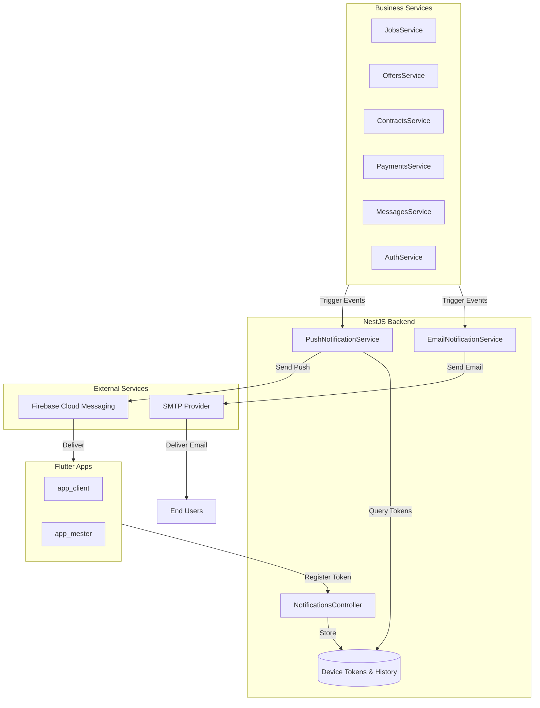
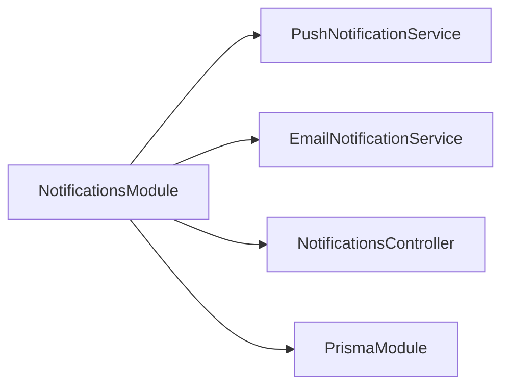
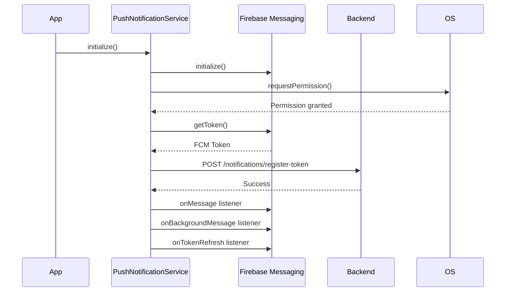

# Push Notifications and Email Notifications System Design

## 1. System Overview

The notification system provides a comprehensive communication infrastructure for the Mesteri Platform, enabling real-time push notifications via Firebase Cloud Messaging and transactional email notifications for both client and craftsman users.

### 1.1 Objectives

- Deliver timely push notifications to mobile and web clients for critical business events
- Send professional, branded email notifications for important transactions and system events
- Maintain notification delivery history and user preferences
- Ensure reliable message delivery with retry mechanisms and error handling
- Support notification personalization and localization
- Enable notification routing to appropriate screens in Flutter applications
- Provide administrative tools for testing and monitoring notifications

### 1.2 Core Capabilities

| Capability | Description |
|------------|-------------|
| Push Notifications | Real-time FCM-based push notifications to iOS, Android, and Web platforms |
| Email Notifications | Templated HTML emails with attachments for transactional events |
| Device Token Management | Registration, storage, and lifecycle management of FCM device tokens |
| Notification History | Persistent storage of notification events for auditing and user history |
| User Preferences | Per-user notification settings and opt-out mechanisms |
| Batch Notifications | Efficient delivery to multiple recipients simultaneously |
| Deep Linking | Route users to specific screens based on notification type and context |

## 2. System Architecture

### 2.1 High-Level Components



### 2.2 Technology Stack

| Component | Technology | Purpose |
|-----------|-----------|---------|
| Push Notifications | Firebase Cloud Messaging | Cross-platform push notification delivery |
| Email Delivery | Nodemailer | SMTP client for email transmission |
| Template Engine | Handlebars | Email template rendering |
| Backend Framework | NestJS | Service orchestration and API endpoints |
| Database | PostgreSQL + Prisma | Token storage and notification history |
| Flutter SDK | firebase_messaging | Mobile push notification handling |
| Local Notifications | flutter_local_notifications | Foreground notification display |

## 3. Backend Implementation Design

### 3.1 Module Structure

The NotificationsModule will be enhanced with two specialized services and new database entities:



### 3.2 Database Schema Extensions

The existing Prisma schema requires the following new models:

#### DeviceToken Model

Stores FCM tokens for push notification delivery.

| Field | Type | Description |
|-------|------|-------------|
| id | String | Unique identifier |
| userId | String | Reference to User |
| token | String | FCM device token |
| platform | Enum | Device platform: IOS, ANDROID, WEB |
| createdAt | DateTime | Token registration timestamp |
| lastUsedAt | DateTime | Last successful notification delivery |

**Constraints:**
- Composite unique index on userId and token to prevent duplicates
- Foreign key to User with cascade delete
- Index on userId for fast lookup

#### NotificationPreference Model

Stores user-specific notification settings.

| Field | Type | Description |
|-------|------|-------------|
| id | String | Unique identifier |
| userId | String | Reference to User |
| notificationType | Enum | Type: NEW_JOB, OFFER_ACCEPTED, CONTRACT_SIGNED, etc. |
| pushEnabled | Boolean | Enable push notifications |
| emailEnabled | Boolean | Enable email notifications |

**Constraints:**
- Composite unique index on userId and notificationType
- Default values: pushEnabled = true, emailEnabled = true

#### NotificationLog Model

Audit trail for all sent notifications.

| Field | Type | Description |
|-------|------|-------------|
| id | String | Unique identifier |
| userId | String | Recipient user ID |
| type | Enum | Notification type |
| channel | Enum | Delivery channel: PUSH, EMAIL |
| status | Enum | Delivery status: SENT, FAILED, PENDING |
| metadata | JSON | Notification payload and context |
| sentAt | DateTime | Transmission timestamp |
| deliveredAt | DateTime | Delivery confirmation timestamp (optional) |
| errorMessage | String | Error details if failed |

### 3.3 PushNotificationService

#### Responsibilities

- Initialize Firebase Admin SDK with service account credentials
- Manage device token registration and removal
- Send individual and batch push notifications
- Handle FCM response processing and error recovery
- Query notification delivery status

#### Core Methods

| Method | Parameters | Return Type | Purpose |
|--------|-----------|-------------|---------|
| initializeFirebase | serviceAccountPath: string | void | Initialize Firebase Admin SDK |
| sendPushNotification | userId, title, body, data | NotificationResult | Send push to specific user |
| sendToMultipleDevices | userIds, notification | BatchResult | Send to multiple users |
| registerDeviceToken | userId, token, platform | DeviceToken | Store new device token |
| removeDeviceToken | userId, token | void | Remove token on logout |
| refreshTokenStatus | userId, token | void | Update lastUsedAt timestamp |

#### Notification Event Triggers

| Event | Trigger Condition | Target Audience | Payload Data |
|-------|------------------|-----------------|--------------|
| onNewJobOffer | Client posts job matching craftsman's category | Craftsmen with matching specialty | jobId, jobTitle, category, location, budget |
| onOfferAccepted | Client accepts craftsman offer | Craftsman who submitted offer | offerId, jobId, clientName, acceptedAmount |
| onContractSigned | Contract signature received | Counterparty user | contractId, projectId, signerRole |
| onPaymentReceived | Payment released to craftsman wallet | Craftsman | paymentId, amount, projectTitle |
| onNewMessage | Message sent while recipient offline | Message recipient | conversationId, senderId, senderName, messagePreview |

#### Error Handling Strategy

| Error Type | Recovery Action |
|-----------|-----------------|
| Invalid Token | Remove token from database, log event |
| Network Timeout | Retry up to 3 times with exponential backoff |
| FCM Service Unavailable | Queue notification for later retry, alert monitoring |
| User Has No Tokens | Skip push delivery, log warning |
| Rate Limit Exceeded | Implement exponential backoff, queue messages |

### 3.4 EmailNotificationService

#### Responsibilities

- Configure SMTP transport using Nodemailer
- Load and render Handlebars email templates
- Send transactional emails with optional attachments
- Track email delivery status
- Generate PDF attachments for contracts

#### Core Methods

| Method | Parameters | Return Type | Purpose |
|--------|-----------|-------------|---------|
| configureSMTP | config: SMTPConfig | void | Initialize SMTP transport |
| sendWelcomeEmail | user: User | EmailResult | Send onboarding email |
| sendContractNotification | user, contract, action, pdfBuffer | EmailResult | Send contract-related email |
| sendPaymentConfirmation | user, payment | EmailResult | Send payment receipt |
| sendOfferNotification | client, offer | EmailResult | Notify client of new offer |
| sendJobCompletionEmail | users, project | EmailResult | Notify project completion |
| renderTemplate | templateName, data | string | Render Handlebars template |

#### Email Templates

All templates stored in `/backend/src/notifications/templates/` directory with `.hbs` extension.

| Template Name | Purpose | Variables |
|--------------|---------|-----------|
| welcome.hbs | Post-registration welcome | fullName, email, role, accountCreatedDate |
| contract-created.hbs | New contract notification | contractId, projectTitle, amount, clientName, craftsmanName |
| contract-signed.hbs | Contract signature confirmation | contractId, signerName, signedAt, nextSteps |
| payment-confirmation.hbs | Payment receipt | transactionId, amount, recipientName, projectTitle, paymentDate |
| offer-submitted.hbs | Craftsman offer received | offerAmount, craftsmanName, estimatedDays, offerNotes |
| project-completed.hbs | Project completion notice | projectTitle, completionDate, finalAmount, nextSteps |

#### Email Template Structure

Each email template must include:

- Responsive HTML layout compatible with major email clients
- Header section with platform logo and brand colors
- Main content area with dynamic data placeholders
- Call-to-action button linking to relevant app screen
- Footer with contact information, social media links, and unsubscribe link
- Text-only alternative for email clients that don't support HTML

#### SMTP Configuration

Environment variables required:

| Variable | Description | Example |
|----------|-------------|---------|
| SMTP_HOST | SMTP server hostname | smtp.gmail.com |
| SMTP_PORT | SMTP server port | 587 |
| SMTP_SECURE | Use TLS | false |
| SMTP_USER | SMTP authentication username | notifications@mesteri.ro |
| SMTP_PASS | SMTP authentication password | app-specific-password |
| FROM_EMAIL | Sender email address | no-reply@mesteri.ro |
| FROM_NAME | Sender display name | Mesteri Platform |

**Development Environment:** Use Mailtrap or similar service to intercept emails during testing.

**Production Environment:** Use enterprise SMTP providers (SendGrid, Mailgun, AWS SES) with SPF, DKIM, and DMARC configuration.

### 3.5 NotificationsController

#### API Endpoints

| Endpoint | Method | Purpose | Request Body | Response |
|----------|--------|---------|--------------|----------|
| /notifications/register-token | POST | Register FCM token | { token, platform } | DeviceToken |
| /notifications/remove-token | POST | Remove FCM token | { token } | Success message |
| /notifications/test-push | POST | Send test notification (admin) | { userId, title, body, data } | NotificationResult |
| /notifications/history/:userId | GET | Get notification history | N/A | NotificationLog[] |
| /notifications/preferences/:userId | GET | Get user preferences | N/A | NotificationPreference[] |
| /notifications/preferences/:userId | PUT | Update preferences | { type, pushEnabled, emailEnabled } | NotificationPreference |
| /notifications/unsubscribe/:token | GET | Unsubscribe from emails | N/A | Success message |

#### Authentication and Authorization

- All endpoints require Firebase authentication via FirebaseAuthGuard
- Token registration/removal requires authenticated user to match target userId
- Test endpoint restricted to admin role users only
- History and preferences endpoints enforce user ownership verification

## 4. Integration Points

### 4.1 Service Integration Matrix

Each core business service must trigger notifications at specific lifecycle events:

| Service | Event Hook | Notification Type | Recipients |
|---------|-----------|-------------------|-----------|
| JobsService | After job creation | onNewJobOffer (Push) | Craftsmen with matching category |
| OffersService | After offer acceptance | onOfferAccepted (Push + Email) | Craftsman who submitted offer |
| ContractsService | After contract signature | onContractSigned (Push + Email) | Counterparty signer |
| PaymentsService | After payment release | onPaymentReceived (Push + Email) | Craftsman recipient |
| MessagesService | After message sent | onNewMessage (Push, conditional) | Recipient if offline |
| AuthService | After user registration | Welcome Email | Newly registered user |

### 4.2 Integration Implementation Pattern

Each service will inject NotificationsModule dependencies and invoke notification methods after successful state mutations:

**Example Pattern:**
1. Business operation completes successfully
2. Transaction commits to database
3. Retrieve recipient user details
4. Check user notification preferences
5. Invoke PushNotificationService and/or EmailNotificationService
6. Handle notification errors gracefully without failing business operation
7. Log notification attempt to NotificationLog

### 4.3 Conditional Notification Rules

| Notification Type | Delivery Condition |
|------------------|-------------------|
| onNewJobOffer | Only send to craftsmen with specialty matching job category AND within geographic radius (if configured) |
| onNewMessage | Only send push if recipient not currently viewing the conversation |
| All Types | Respect user notification preferences (check NotificationPreference table) |
| Email Notifications | Do not send if user has unsubscribed |

## 5. Flutter Client Implementation Design

### 5.1 Flutter Package Dependencies

Add to `pubspec.yaml` in both `app_client` and `app_mester`:

| Package | Version | Purpose |
|---------|---------|---------|
| firebase_messaging | ^14.7.9 | FCM integration |
| flutter_local_notifications | ^16.3.0 | Foreground notification display |

### 5.2 PushNotificationService (Flutter)

#### Responsibilities

- Initialize Firebase Messaging SDK
- Request notification permissions from operating system
- Retrieve FCM token and register with backend
- Handle foreground, background, and terminated state notifications
- Display local notifications when app is in foreground
- Parse notification payload and route to appropriate screen
- Handle token refresh events

#### Initialization Flow



#### Notification Handlers

| Handler | State | Behavior |
|---------|-------|----------|
| onMessage | Foreground | Display local notification with custom UI |
| onBackgroundMessage | Background | System displays notification |
| onMessageOpenedApp | App opened from notification | Navigate to target screen |
| onTokenRefresh | Token updated | Send new token to backend |

#### Platform-Specific Configurations

**iOS:**
- Request provisional authorization for silent notifications
- Configure notification presentation options (alert, sound, badge)
- Handle APNs token retrieval via Firebase

**Android:**
- Create notification channel for high-priority notifications
- Configure notification importance levels
- Set custom notification icon and color
- Handle notification taps via intent data

**Web:**
- Request browser notification permission
- Register service worker for background notifications
- Handle notification click events

### 5.3 NotificationHandler - Deep Linking

#### Routing Strategy

Map notification types to application screens with contextual parameters:

| Notification Type | Target Screen | Navigation Parameters |
|------------------|---------------|----------------------|
| new_job | JobDetailsScreen | jobId |
| offer_accepted | MyOffersScreen | offerId (optional) |
| contract_signed | ContractReviewScreen | contractId |
| payment_received | WalletScreen | paymentId (optional) |
| new_message | ChatConversationScreen | conversationId, senderId |

#### Navigation Implementation

Use GoRouter or Navigator 2.0 to handle deep links with proper route validation and state management. Handle scenarios where target screen requires authentication or data loading.

### 5.4 In-App Notification UI

#### Notification Badge System

Display unread notification count on BottomNavigationBar using a badge widget overlaid on relevant navigation items.

**Badge Rules:**
- Fetch unread count from `/notifications/history/:userId?isRead=false`
- Update count on app foreground entry
- Decrement count when notification is marked as read
- Refresh count after WebSocket notification event received

#### Notification Settings Screen

Provide user interface for managing notification preferences:

- Toggle push notifications per notification type
- Toggle email notifications per notification type
- Test notification delivery
- View notification history with timestamps
- Clear notification history

**UI Components:**
- Switch widgets for each notification type
- Grouped settings by category (Job Updates, Payments, Messages)
- Save button to persist changes to backend
- Loading and error states with user feedback

## 6. Production-Ready Features

### 6.1 Error Handling and Resilience

| Component | Error Handling Strategy |
|-----------|----------------------|
| PushNotificationService | Retry failed sends with exponential backoff (1s, 5s, 25s); log failures to NotificationLog |
| EmailNotificationService | Queue failed emails to retry queue; alert monitoring after 3 failures |
| Token Registration | Handle duplicate tokens gracefully; update lastUsedAt on duplicates |
| Template Rendering | Catch rendering errors; fall back to plain text email; log template errors |

### 6.2 Retry Logic Configuration

| Parameter | Value | Rationale |
|-----------|-------|-----------|
| Max Retry Attempts | 3 | Balance delivery guarantee with resource consumption |
| Initial Backoff | 1 second | Quick retry for transient network issues |
| Backoff Multiplier | 5x | Exponential increase to avoid overwhelming services |
| Max Backoff | 60 seconds | Cap maximum delay for user experience |

### 6.3 Rate Limiting

Implement rate limiting to prevent notification spam and abuse:

| Limit Type | Threshold | Action |
|------------|-----------|--------|
| Per User | 100 notifications/hour | Queue excess notifications |
| Per Device | 50 notifications/hour | Drop excess notifications |
| System-Wide | 10,000 notifications/minute | Enable backpressure mode |

### 6.4 Notification Preferences

Users can control notification delivery through preferences:

- Opt-out of specific notification types
- Disable all push notifications
- Disable all email notifications
- Set quiet hours (no push notifications during specified times)
- Unsubscribe from email via link in email footer

**Unsubscribe Mechanism:**
- Generate unique unsubscribe token per user
- Include token in email footer link: `/notifications/unsubscribe/:token`
- Mark all email preferences as disabled for user
- Display confirmation page

### 6.5 Delivery Status Tracking

Log all notification attempts to NotificationLog table with delivery status:

| Status | Description |
|--------|-------------|
| PENDING | Notification queued for delivery |
| SENT | Successfully transmitted to FCM/SMTP |
| DELIVERED | Delivery confirmed by provider (if available) |
| FAILED | Delivery failed after retries |
| BOUNCED | Email bounced (invalid recipient) |

### 6.6 Monitoring and Observability

Track key metrics for notification system health:

| Metric | Purpose | Alert Threshold |
|--------|---------|----------------|
| Notification Delivery Rate | Success percentage | < 95% |
| Average Delivery Latency | Time from trigger to delivery | > 5 seconds |
| Failed Notification Count | Volume of failures | > 100/hour |
| Token Registration Rate | New device registrations | N/A (monitoring only) |
| Email Bounce Rate | Invalid email addresses | > 5% |

### 6.7 Security Considerations

| Concern | Mitigation |
|---------|------------|
| Token Hijacking | Validate token ownership before sending notifications |
| Email Spoofing | Configure SPF, DKIM, DMARC records for domain |
| Sensitive Data in Notifications | Exclude sensitive information from push payloads; require app authentication to view details |
| Notification Spam | Implement per-user rate limiting and abuse detection |
| Unauthorized Access | Enforce Firebase authentication on all notification endpoints |

## 7. Configuration Management

### 7.1 Backend Environment Variables

All configuration values must be provided via environment variables:

| Variable | Description | Required | Default |
|----------|-------------|----------|---------|
| FIREBASE_SERVICE_ACCOUNT_PATH | Path to Firebase Admin credentials JSON | Yes | N/A |
| SMTP_HOST | SMTP server hostname | Yes | N/A |
| SMTP_PORT | SMTP server port | Yes | N/A |
| SMTP_SECURE | Use TLS connection | No | false |
| SMTP_USER | SMTP authentication username | Yes | N/A |
| SMTP_PASS | SMTP authentication password | Yes | N/A |
| FROM_EMAIL | Sender email address | Yes | N/A |
| FROM_NAME | Sender display name | Yes | N/A |
| NOTIFICATION_RETRY_ENABLED | Enable retry logic | No | true |
| NOTIFICATION_MAX_RETRIES | Maximum retry attempts | No | 3 |
| NOTIFICATION_RATE_LIMIT_PER_USER | Max notifications per user per hour | No | 100 |

### 7.2 Firebase Service Account Setup

Obtain Firebase Admin SDK credentials:

1. Navigate to Firebase Console project settings
2. Select "Service Accounts" tab
3. Generate new private key
4. Download JSON file
5. Store securely in backend deployment environment
6. Set FIREBASE_SERVICE_ACCOUNT_PATH to file location
7. Ensure file permissions restrict access to backend process only

### 7.3 SMTP Provider Configuration

**Development:** Use Mailtrap for email testing without sending real emails.

**Production Options:**

| Provider | Advantages | Configuration |
|----------|-----------|---------------|
| SendGrid | High deliverability, good analytics | API key authentication, verified sender domain |
| Mailgun | Developer-friendly, flexible | API key + domain verification |
| AWS SES | Low cost, AWS integration | IAM credentials, domain verification |
| Gmail SMTP | Quick setup, familiar | App-specific password, 2FA required |

## 8. Testing Strategy

### 8.1 Backend Testing

| Test Type | Scope | Key Scenarios |
|-----------|-------|--------------|
| Unit Tests | Individual service methods | Token registration, notification formatting, template rendering |
| Integration Tests | Service + Database | End-to-end notification flow, preference enforcement |
| E2E Tests | Full notification pipeline | Job creation → push notification delivery |

### 8.2 Flutter Testing

| Test Type | Scope | Key Scenarios |
|-----------|-------|--------------|
| Widget Tests | Notification UI components | Badge display, settings screen |
| Integration Tests | PushNotificationService | Token registration, notification handling |
| Manual Tests | Device-specific | iOS permission handling, Android notification channels |

### 8.3 Test Notification Endpoint

The `/notifications/test-push` endpoint enables administrators to validate notification delivery:

**Request:**
```
POST /notifications/test-push
Authorization: Bearer {admin-firebase-token}
Content-Type: application/json

{
  "userId": "target-user-id",
  "title": "Test Notification",
  "body": "This is a test notification",
  "data": {
    "type": "test",
    "timestamp": "2024-01-15T10:30:00Z"
  }
}
```

**Use Cases:**
- Verify FCM integration during deployment
- Troubleshoot user-reported notification issues
- Validate notification routing and deep linking

## 9. Deployment Considerations

### 9.1 Deployment Checklist

- [ ] Install required npm packages in backend
- [ ] Add Flutter packages to both mobile apps
- [ ] Configure Firebase project for FCM
- [ ] Generate and store Firebase Admin SDK credentials
- [ ] Set all required environment variables
- [ ] Apply Prisma schema migrations for new models
- [ ] Configure SMTP provider with domain verification
- [ ] Set up SPF, DKIM, DMARC DNS records for email domain
- [ ] Create email templates in templates directory
- [ ] Configure notification channels in Android apps
- [ ] Request notification permissions in iOS apps
- [ ] Deploy backend with new NotificationsModule
- [ ] Test notification delivery end-to-end
- [ ] Monitor notification delivery metrics

### 9.2 Rollout Strategy

1. Deploy backend changes to staging environment
2. Test notification delivery with test users
3. Deploy Flutter app updates to internal testers via TestFlight/Play Console beta
4. Validate deep linking and notification routing
5. Gradually roll out to production users
6. Monitor error rates and delivery metrics closely
7. Have rollback plan ready for critical issues

### 9.3 Backwards Compatibility

Ensure existing NotificationsService CRUD operations remain functional during migration:
- Preserve existing Notification model for in-app notification history
- New push/email services augment rather than replace existing functionality
- Maintain existing API endpoints for notification history retrieval

## 10. Future Enhancements

| Enhancement | Description | Priority |
|------------|-------------|----------|
| Rich Push Notifications | Images, action buttons, custom layouts | Medium |
| Notification Scheduling | Delay delivery to optimal times | Low |
| A/B Testing | Test notification copy variations | Low |
| Multi-Language Support | Localized templates for Romanian/English | Medium |
| WebSocket Real-Time Updates | Instant notification without polling | High |
| Notification Analytics Dashboard | Admin view of delivery metrics | Medium |
| SMS Notifications | Fallback for critical alerts | Low |
| In-App Notification Center | Unified view of all notifications | Medium |
